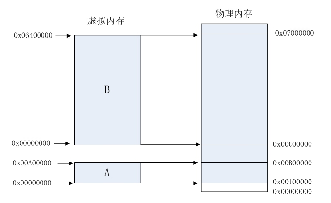
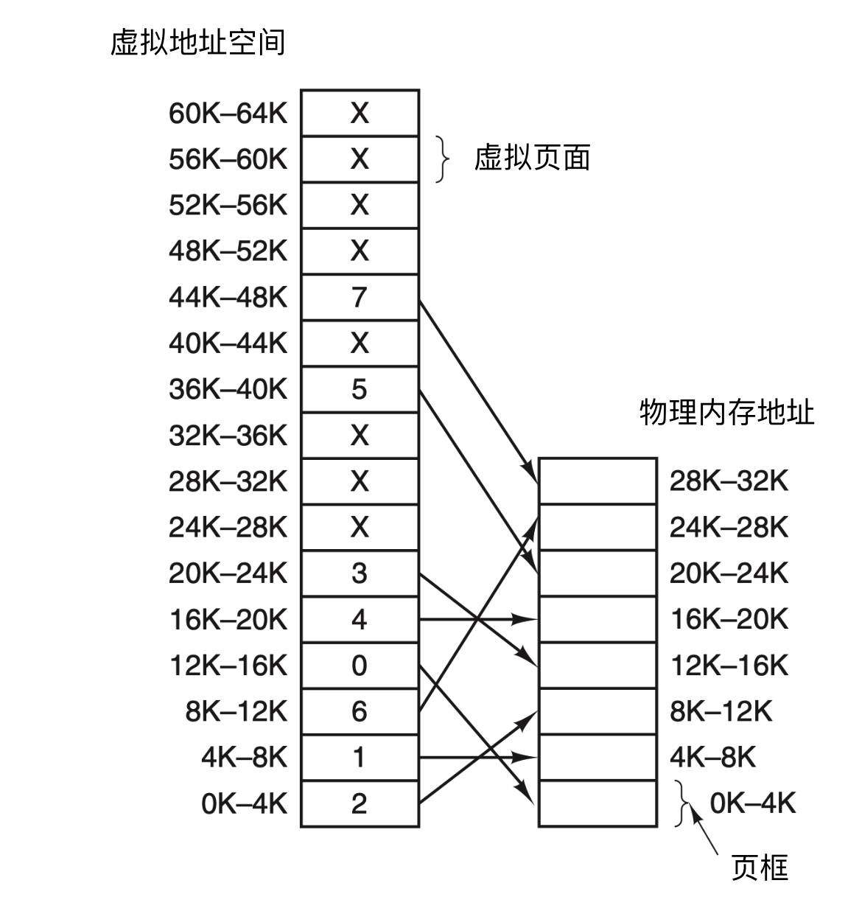
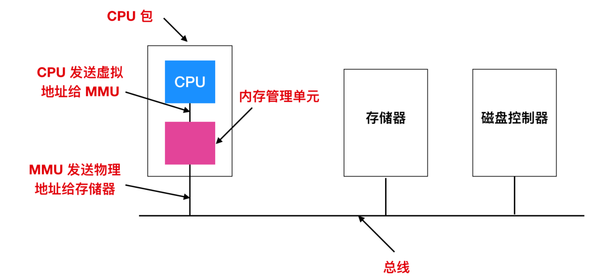
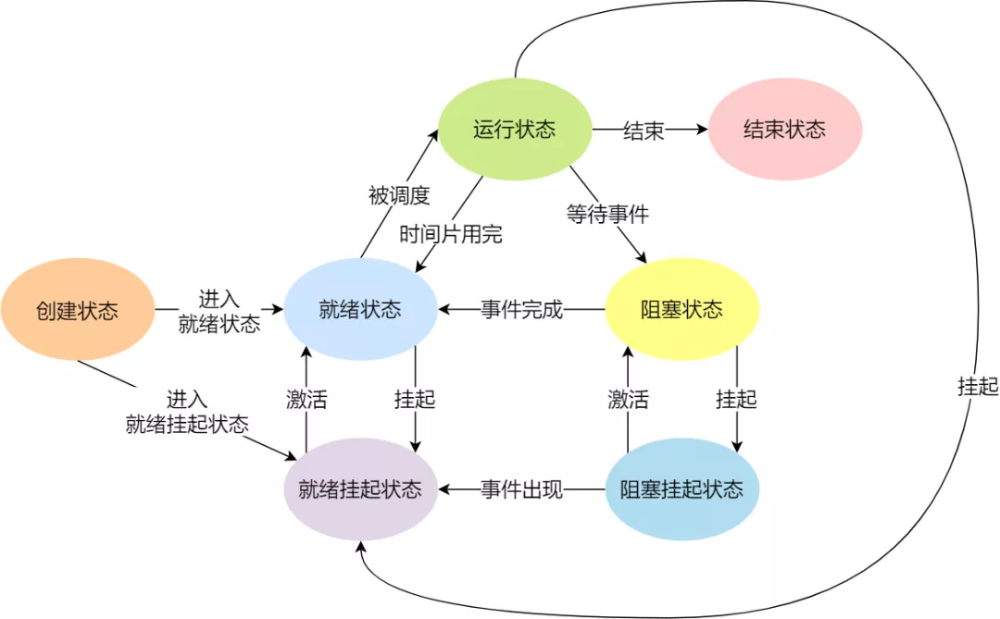
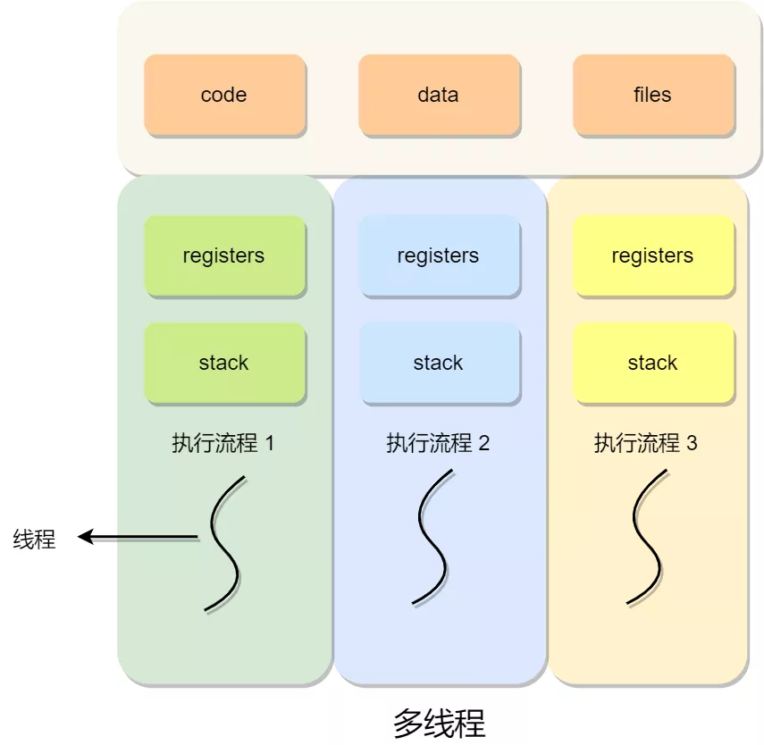
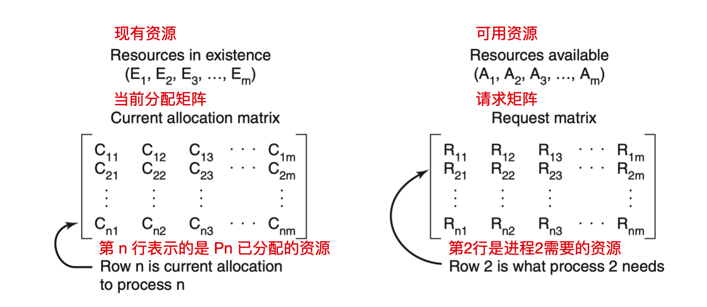
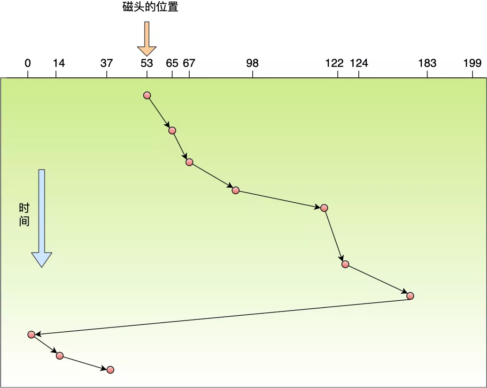

操作系统可以看成是应用程序和硬件之间插入的一层软件，《深入理解计算机体系结构》中指出操作系统所具有的两个基本功能：

1. 防止硬件被失控的应用程序滥用
2. 向应用程序提供简单一致的机制来控制复杂而又通常大不相同的低级硬件设备。

操作系统通过几个基本的抽象概念（进程、虚拟内存和文件）来实现这两个功能。

==进程是对一个正在运行的程序的抽象，虚拟内存是对程序存储器的抽象，文件是对IO设备的抽象。==

## 一、虚拟化

### CPU虚拟化

为了让用户感到计算资源强大、响应速度快，通过时分共享CPU技术，让一个进程只运行一个时间片，然后切换到其他进程，造成多个程序同时运行的假象。

#### 控制权

如何在有效运行进程的基础上，保留对CPU的控制权？

1. 引入==**用户态和内核态**==两种模式。在用户态下，进程不能发出IO请求，如需访问文件或者其他硬件资源，需要调用处于内核态的OS提供对应的系统调用。换句话说，**内核态和用户态只是不同权限的资源范围。**

   - 进程如何执行系统调用？

     先执行特殊的陷阱指令，跳入内核并将特权级别提升到内核模式，然后执行需要的特权操作（打开、读取文件），完成后，OS调用一个陷阱返回指令，回到调用的用户程序中，降低特权级别，回到用户态。

     在这个过程中，OS需要保存和恢复上下文。

2. 添加时钟中断帮助OS维持对CPU的控制权，没发生一次时钟中断，陷入内核态，在时钟中断处理程序中，OS决定下一个运行的程序。

   1. 单处理器调度算法（见[进程调度算法](###进程调度算法)）
   2. 多处理器调度
      - 单队列调度，容易构建，负载均衡较好
      - 多队列调度，很好的扩展性和缓存亲和度，但是难以做到负载均衡
   3. 中断（见下面）

#### 异常和中断

异常就是控制流中的突变，用来响应处理器状态中的某些变化。任何情况下，当处理器检测到有事件发生时，它就会通过异常表，进行一个间接过程的调用，到一个专门用来处理这类事件的操作系统子程序（异常处理程序）。

##### 异常处理

在系统启动时，操作系统分配和初始化一张称为异常表的跳转表，使得表目k包含异常k的处理程序的地址。

当异常发生时，通过表目k，跳转到对应的异常处理程序的地址。

异常类似于过程调用，但是有一些重要的不同之处：

- 过程调用时，在跳转到处理程序之前，处理器将返回地址压入栈中；而异常的返回地址要么是当前指令，要么是下一条指令。
- 处理器也把一些额外的处理器状态压入栈中，然后在处理程序返回时，重新开始执行被中断的程序会需要这些状态。
- 如果控制从用户程序转移到内核，所有这些项目都被压入到内核栈中，而不是压到用户栈。
- 异常处理程序运行在内核模式下，这意味着它们对所有的系统资源都有完全访问权限。

一旦硬件触发异常，剩下的工作就是由异常处理程序在软件中完成。在处理程序处理完事件之后，它通过执行一条特殊的“从中断返回”指令，返回到被中断程序的地址，将适当的状态弹回到处理器的控制和数据寄存器中，如果被异常中断的是一个用户程序，就将状态恢复为用户模式，然后将控制返回给被中断的程序。

##### 异常的类别

| 类别 | 原因                 | 异步or同步 | 返回行为             |
| ---- | -------------------- | ---------- | -------------------- |
| 中断 | 来自IO设备的同步信号 | 异步       | 总是返回到下一条指令 |
| 陷阱 | 有意的异常           | 同步       | 总是返回到下一条指令 |
| 故障 | 潜在可恢复的故障     | 同步       | 可能返回到当前指令   |
| 终止 | 不可恢复的错误       | 同步       | 不会返回             |

具体地：

1. **中断**：中断是来自处理器外部的IO设备的信号的结果。硬件中断不是由任何一条专门的指令造成的，从这个意义上来说，它是异步的。硬件中断的异常处理程序常常称为中断处理程序。IO设备例如网络适配器、磁盘控制器和定时器芯片，通过向处理器芯片上的一个引脚发送信号，并将异常号放在IO总线上，来触发中断，异常号标识了触发中断的设备。当前执行执行完以后，处理器注意到了中断引脚上的高电压，然后就从系统总线上读取异常号，然后调用适当的中断处理程序。当处理程序返回时，它就将控制返回给下一条指令，就像好像没有发生过中断一样。

2. **陷阱和系统调用**：陷阱是有意的异常，是执行一条指令的结果。就像中断处理程序一样，陷阱处理程序将控制权返回到下一条指令。陷阱最重要的用途是在用户程序和内核之间提供一个像过程一样的接口，叫做系统调用。用户程序经常需要向内核请求服务，比如读一个文件（read）、创建一个新的进程（fork）、加载一个新的程序（execve）或者终止当前进程（exit）。为了允许对这些内核服务的受控访问，处理器提供了一条特殊的`syscall n`指令，当用户程序想要请求服务n时，可以执行这条指令。执行syscall指令会导致一个到异常处理程序的陷阱。

3. **故障**：故障由错误引起，它可能能够被故障处理程序修正。当故障发生时，处理器将控制权交给故障处理程序，如果故障处理程序能够修正这个错误情况，它就将控制权返回给引起故障的指令，从而重新执行它。否则，处理程序返回到内核的abort例程，abort例程会终止引起故障的应用程序。

    例如，缺页异常，当指令引用一个虚拟地址，而与该地址相对应的物理页面不在内存中，因此必须从磁盘中取出时，就会发生故障。缺页处理程序会从磁盘中加载适当的页面，然后将控制权返回给引起故障的指令。当指令再次执行时，相应的物理页面就已经存在于内存中了。

4. **终止**：终止是不可恢复的致命错误造成的结果，通常是一些硬件错误，处理程序将控制返回给一个abort例程，该例程会终止这个应用程序。

简单的可以总结为同步中断和异步中断：

* 同步中断（异常）——CPU内，控制单元产生，是执行当前指令的结果，这类指令叫做故障指令

  当指令执行时由CPU控制单元产生的中断，只有在一条指令执行后才会发出中断。比如软中断，由内核触发，以内核线程的方式执行，比如除数为0，缺页等。

* 异步中断（中断）——其他硬件设备发出

  由硬件设备依照CPU时钟随机产生的中断，中断能在指令之间发生。比如硬中断，由硬件触发，立即执行中断处理程序，打断 CPU 正在执行的任务


#### 用户态和内核态

处理器通常是用某个控制寄存器的一个模式位来提供这种功能的，该寄存器描述了进程当前享有的特权。当设置了这个模式位时，进程就运行在内核模式中。一个运行在内核模式的进程可以执行指令集里的任何指令，并且可以访问系统中的任何内存位置。

没有设置模式位时，进程就运行在用户模式中，此时不允许执行特权指令，比如，停止处理器、改变模式位，或者发起一个IO操作。也不允许用户模式中的进程直接引用地址空间中的内核区域的代码和数据。

运行应用程序代码进程初始时是在用户模式中，进程从用户模式变为内核模式的唯一方式是通过诸如中断、故障或者陷入系统调用这样的异常。当异常发生时，控制传递到异常处理程序，处理器将模式从用户态变成内核模式。处理程序运行在内核模式中，当它返回应用程序代码时，处理器就把模式从内核模式改回到用户模式。

用户态与内核态的切换：

- 保留用户态现场（上下文、寄存器、用户栈等）
- 复制用户态参数，用户栈切到内核栈，进入内核态
- 额外的检查（因为内核代码对用户不信任）
- 执行内核态代码
- 复制内核态代码执行结果，回到用户态
- 恢复用户态现场（上下文、寄存器、用户栈等）

### 内存虚拟化

#### 如果没有内存虚拟化

在20实际80年代的计算机，（内存小，无法支持多个程序同时运行，CPU算力也不支持），都没有内存抽象，每个程序都直接访问物理内存。这种情况下，计算机不可能会有两个程序同时在内存中，否则一个程序使用的内存随时都有可能被另一个程序修改，两个程序都会崩溃。

在内存虚拟化之前，还有一种存储器抽象，叫做地址空间，在此处略过。

#### 什么是内存虚拟化

虚拟内存是一个抽象概念，它为每一个进程提供了一个假象，即每个进程都在独占地使用主存储器。每个进程看到的内存都是一致的，称为虚拟地址空间。每个进程都有自己的虚拟地址空间，通过操作系统映射到物理内存上，一个正在运行的程序的内存不会影响到其他进程（包括操作系统本身）的地址空间。便于程序员编程，无需考虑具体存储到哪一个物理地址上。

每个进程看到的虚拟地址空间由大量准确定义的区构成，每个区都有专门的功能，如下图所示，从上到下分别是：


- 程序代码和数据。对于所有的进程来说，代码是从同一固定地址开始，紧接着的是和C全局变量相对应的数据位置。
- 堆。代码和数据区后紧随着的是运行时栈。代码和数据区在进程一开始运行时就被指定了大小，与其不同的是，当调用malloc和free这样的C标准库函数的时候，堆可以在运行时动态地扩展和收缩。
- 共享库。大约在地址空间中的中间部分存放的是像C标准库和数学库这样的共享库的代码和数据的区域。
- 栈。位于用户虚拟地址空间顶部的是用户栈，编译器利用它来实现函数调用。和堆一样，栈在程序执行期间可以动态地扩展和收缩。特别的，我们每调用一个函数的时候，栈就会增长；从一个函数返回时，栈就会收缩。
- 内核虚拟内存。地址空间的顶部区域是为内核保留的。不允许应用程序读写这个区域的内容或者直接调用内核代码定义的函数，需要调用内核来执行这些操作。


由于软件大小的增长越来越快，对内存的需求越来越大，操作系统同时要支持多个程序同时运行，即使内存大小可以满足单独一个程序的需要，但是应用程序越大，花在内存与磁盘交换数据上的时间就越多。

同时，虚拟地址空间需要与真实物理空间简历一种映射关系。为此，提出了分段到方法，它的思想是在虚拟地址空间和物理地址空间之间做一一映射。比如说虚拟地址空间中某个10M大小的空间映射到物理地址空间中某个10M大小的空间。这种思想理解起来并不难，操作系统保证不同进程的地址空间被映射到物理地址空间中不同的区域上，这样每个进程最终访问到的，而且在进程之间实现了隔离。



如上图所示，程序A和B的地址空间在程序员看来都是从地址0x0000 0000开始的，但是在实际的物理内存上，是被映射到了不同的段上面。

但是分段仍有两个问题：

1. 内存使用效率的问题：在分段映射方法中，每次换入和换出的都是整个程序，这样会造成大量磁盘访问操作。而且，**程序的运行具有局部性**，在某段时间内，程序只访问一小部分内存数据，其他的数据在一段时间内都不会被访问到。
2. 物理内存的碎片化：分段会导致物理内存被分成了不同大小的内存段，在程序运行完毕以后，所占用的内存会被回收，但是其他在运行的程序依旧占用了之前的内存空间，这就导致了空闲的内存段空间不连续，原本有足够的空间，但是碎成多块，使得无法给当前程序分配足够大小的分段。

因此，人们提出了粒度更小，大小统一的内存分割和映射方法，这种方法就是分页。

#### 分页

分页的基本方法是，将地址空间分成许多的页。每页的大小由CPU决定，然后由操作系统选择页的大小。目前Inter系列的CPU支持4KB或4MB的页大小，而PC上目前都选择使用4KB。按这种选择，4GB虚拟地址空间共可以分成1048576个页，512M的物理内存可以分为131072个页。显然虚拟空间的页数要比物理空间的页数多得多。

在分段的方法中，每次程序运行时总是把程序全部装入内存，而分页的方法则有所不同。分页的思想是程序运行时用到哪页就为哪页分配内存，没用到的页暂时保留在硬盘上。当用到这些页时再在物理地址空间中为这些页分配内存，然后建立虚拟地址空间中的页和刚分配的物理内存页间的映射。下图展示这种映射是如何进行的：




> 在使用虚拟地址时，虚拟地址不会直接发送到内存总线上，相反会使用MMU（Memory Management Unit）内存管理单元把虚拟地址映射为物理地址。如下图：
>
> 

#### 页表


#### 一些问题

- 问题1：如何将虚拟地址映射到物理内存上？

  方法有纯软件的静态重定位和基于硬件的动态重定位。动态重定位较好。

- 问题2：如何实现动态重定位的同时，防止一些当前未使用的内存空间被占用，从而导致浪费？

  为了防止内存空间的浪费，在动态重定位引入了分段，将地址空间分成代码段、栈段、堆段，将不同的段重定位到不同的物理内存区域。

- 问题3：分段还不足以支持更一般化的稀疏地址空间，如果有一个很大但是稀疏的堆都在一个逻辑段中，整个堆仍然必须完整地加载到内存中。如何更细粒度地实现稀疏地址空间映射？

  分页。将空间分成固定长度的分片，在物理内存中记录各个页的地址映射信息。

- 问题4：在转换虚拟地址时，分页逻辑上需要一次额外的内存访问，如何才能加速虚拟地址转换，避免额外的内存访问？

  在芯片内引入地址转换缓存**TLB**，对每次内存访问，硬件先检查TLB，如果有期望的转换映射，就不需要访问页表，否则再去访问页表。

- 问题5：页表太大，导致内存消耗过多，如何降低页表大小？

  1. 更大的页。导致内部碎片。
  2. 段页式。导致外部碎片。
  3. N级页表。在TLB未命中时，需要从内存加载N次，同时也增加了复杂性
  4. 在硬盘上开辟交换空间，达到假装内存比实际物理内存更大的目的，配合一页一页的加载方式，能够让OS为多个并发运行的进程都提供巨大地址空间的假象。页面置换算法见[缓存算法](###缓存算法)

##### 页表中的常用字段

* 状态位

  表示该页是否有效，也就是说是否在物理内存中

* 访问位

  记录该页在一段时间被访问的次数，供页面置换算法选择出页面时使用

* 修改位

  表示该页在调入内存后是否有被修改过，如果没有，置换置换该页时直接丢弃，否则重写到磁盘上

##### 两种虚拟内存技巧（惰性思想）

1. 按需置零

   正常情况，进程想要在地址空间中添加一个页的时候，操作系统响应该请求，在物理内存中找到页并添加到堆中，并将其置零，然后设置页表以根据需要引用该物理页，但是在页没有被进程使用的情况下，太浪费资源了。

   所以利用按需置零，当页添加到进程的地址空间时，它会在页表中放入一个标记页不可访问的条目，如果进程读取或写入页，再向OS发送陷阱，OS再去寻找物理页并映射到进程的地址空间。

2. 写时复制（COW）

   如果OS将一个页面从一个地址空间复制到另一个地址空间，只是将其映射到目标地址空间，不是实际复制它，并在两个地址空间中将其标记为已读。如果其中一个地址空间需要写入页面，陷入OS，OS分配一个新页，填充数据。

   最常用的例子就是fork和exec的配套使用，fork创建调用者地址空间的精确副本，但随后立马被exec用即将执行的程序覆盖，通过COW，能够避免大量不必要的复制。

## 二、并发

### 进程

进程就是OS为正在运行的程序提供的抽象。

在现代计算机系统上运行一个程序，我们会得到这样的一个假象，就好像我们的程序是系统中当前运行的唯一的程序一样。我们的程序好像是独占使用处理器和内存。这些假象都是通过进程的概念提供给我们的。


#### 进程创建

OS如何创建并运行一个程序？

OS先从磁盘中将代码和所有静态数据（如初始化变量）加载到内存中进程的地址空间上，为程序的运行时栈分配一些内存（8M），为堆分配一些内存以及执行与I/O设置相关的工作（如默认每个进程都有3个打开的文件描述符，用于标准输入、输出和错误）之后，跳转在程序的入口处（main函数），OS将CPU的控制权转移到新创建的进程中，该程序开始运行。

#### 进程状态



在一个进程的活动期间至少具备三种基本状态，即**运行状态、就绪状态、阻塞状态**。

另外，与阻塞状态等待某个事件的返回不同，挂起状态下的进程被换出到硬盘，不占用内存空间。挂起状态分为两种：

- 阻塞挂起状态：进程被换出在外存（硬盘）并等待某个事件的出现；
- 就绪挂起状态：进程被换出在外存（硬盘），但只要进入内存，就能立刻运行；

#### 进程间通信

每个进程的用户地址空间都是独立的，一般而言是不能互相访问的，但内核空间是每个进程都共享的，所以进程之间通信必须要通过内核。

主要的方式有：

- 管道：匿名管道通信、高级管道通信、有名管道通信

  - 匿名管道( pipe )：管道是一种半双工的通信方式，数据只能单向流动，而且只能在具有亲缘关系的进程间使用。进程的亲缘关系通常是指父子进程关系。父进程可以往管道里写，子进程可以从管道里读。管道由环形队列实现。
  - 高级管道( popen )：将另一个程序当做一个新的进程在当前程序进程中启动，则它算是当前程序的子进程，这种方式我们成为高级管道方式。
  - 有名管道 (named pipe) ： 有名管道也是半双工的通信方式，但是它允许无亲缘关系进程间的通信。

- 消息队列

  消息队列是由消息的链表，存放在内核中并由消息队列标识符标识。消息队列克服了信号传递信息少、管道只能承载无格式字节流以及缓冲区大小受限等缺点。

- 共享内存+信号量

  - 信号量( semophore ) ： 信号量是一个计数器，可以用来控制多个进程对共享资源的访问。它常作为一种锁机制，防止某进程正在访问共享资源时，其他进程也访问该资源。因此，主要作为进程间以及同一进程内不同线程之间的同步手段。
  - 共享内存( shared memory )  ：共享内存就是映射一段能被其他进程所访问的内存，这段共享内存由一个进程创建，但多个进程都可以访问。共享内存是最快的 IPC  方式，它是针对其他进程间通信方式运行效率低而专门设计的。它往往与其他通信机制，如信号两，配合使用，来实现进程间的同步和通信。

- 信号：

  上面说的进程间通信，都是常规状态下的工作模式，处于异常情况下的进程，就需要用信号的方式来通知。实际上，信号是进程间通信机制中唯一的异步通信机制，因为可以在任何时候发送信号给某一进程。信号事件的来源主要有两种：

  - 硬件来源

    Ctrl+C 产生 `SIGINT` 信号，表示终止该进程；Ctrl+Z 产生 `SIGTSTP` 信号，表示停止该进程，但还未结束；

  - 软件来源

    `kill -9 1050` ，表示给 PID 为 1050 的进程发送 `SIGKILL` 信号，用来立即结束该进程；

- Socket

  前面说到的通信机制，都是工作于同一台主机，如果要与不同主机的进程间通信，那么就需要Socket通信。根据创建 Socket 的类型不同，分为三种常见的通信方式：

  - TCP字节流通信
  - UDP数据报通信
  - 本地进程间通信

### 线程

线程是进程中的一条执行流程。在 Linux 内核中，进程和线程都是用 `tark_struct` 结构体表示的，区别在于线程的 tark_struct 结构体里部分资源是共享了进程已创建的资源，比如内存地址空间、代码段、文件描述符等，所以 Linux 中的线程也被称为轻量级进程，因为线程的 tark_struct 相比进程的 tark_struct 承载的资源比较少，因此以「轻」得名。



**一个进程中可以并发执行多个线程，每个线程都有独立一套的寄存器和栈用来保证线程的控制流相互独立，除此之外，各个线程之间共享代码段、数据段、打开文件等资源。多线程的一个特性是，当进程中的一个线程奔溃时，会导致其所属进程的所有线程奔溃（内核线程与用户线程是一对多的情况）。**

#### 线程间通信的方式

- 锁机制：互斥锁、条件变量、读写锁、自旋锁
- 信号量机制：包括无名线程信号量和命名线程信号量
- 信号机制：类似进程间的信号机制

#### 进程与线程的区别

* 相同处
  * 二者都具有就绪、阻塞、执行三种基本状态，以及相同的状态转换关系；
  * 二者都可以实现高并发

* 不同处
  * 进程是 OS 调度的单位，线程是 CPU 调度的单位；
  * 每个进程拥有一个完整的资源平台（内存空间、打开文件列表），而线程只独享必不可少的资源，如寄存器和栈
  * 所以，相较于进程，多线程的创建快、属于同一个进程的不同线程的上下文切换快、线程间不需要经过内核的数据通信效率更高。

#### 协程

协程，也叫做用户空间线程，由程序员自己写程序管理的一种比线程更轻量级的存在。


### 同步和互斥

在进程/线程并发执行的过程中，进程/线程之间存在协作的关系，例如有互斥、同步的关系。

* 互斥就是保证一个进程/线程在临界区执行时，其他进程/线程被阻塞，达到避免竞争条件出现的目的。比如「操作 A 和操作 B 不能在同一时刻执行」；
* 而所谓同步，就是指并发进程/线程在一些关键点上可能需要互相等待与互通消息，这种相互制约的等待与互通信息称为进程/线程同步。比如「操作 A 应在操作 B 之前执行」，「操作 C 必须在操作 A 和操作 B 都完成之后才能执行」；

OS如何实现进程协作呢

* 锁：加锁、解锁实现互斥
* 信号量：P、V操作实现互斥和同步
  * P代表减少一个资源，V代表增加一个资源

#### 生产者消费者模型

伪代码：

```
int space = N, items = 0, mutex = 1;		// buffer的剩余空间，buffer的元素个数，互斥锁
queue buffer;							// 使用一个队列作为buffer

producer:
{
	wait(space);	// 等待有剩余空间
	wait(mutex);	// 等待互斥锁，两个顺序不能颠倒，否则会死锁。
	
	// 得到访问buffer的权限以后
	temp = produce()
    buffer.push(temp)
    
    signal(mutex);	// 归还互斥锁
	signal(items);	// 新增一个item，这里的两个唤醒顺序可以颠倒
}

consumer:
{
	wait(items);	// 等待有可用元素
	wait(mutex);	// 等待互斥锁
	
	// 得到访问buffer的权限以后
	temp = buffer.pop();
	consume(temp)
	
	signal(mutex);	// 归还互斥锁
	signal(space);	// 新增一个空闲空间
}

```

上面的 `wait()` 和 `signal()` 都是原子操作。如果这两步非原子操作，则需要在访问space和items前加锁。

#### 互斥锁、条件锁、读写锁、自旋锁（C++）

具体见 [如何理解互斥锁、条件锁、读写锁以及自旋锁？](操作系统.assets/如何理解互斥锁、条件锁、读写锁以及自旋锁？.html)

##### 1. 互斥锁

其思想简单粗暴，多线程共享一个互斥量，然后线程之间去竞争。得到锁的线程可以进入临界区执行代码。mutex是睡眠等待（sleep waiting）类型的锁，当线程抢互斥锁失败的时候，线程会陷入休眠。优点就是节省CPU资源，缺点就是休眠唤醒会消耗一点时间。

```c++
// 声明一个互斥量    
pthread_mutex_t mtx;
// 初始化 
pthread_mutex_init(&mtx, NULL);
// 加锁  
pthread_mutex_lock(&mtx);
// 解锁 
pthread_mutex_unlock(&mtx);
// 销毁
pthread_mutex_destroy(&mtx); 
```

pthread的锁一般都有一个trylock的函数，比如对于互斥量：

```c++
ret = pthread_mutex_trylock(&mtx);
if (0 == ret) { // 加锁成功
    ... 
    pthread_mutex_unlock(&mtx);
} else if(EBUSY == ret){ // 锁正在被使用;
    ... 
}
```

##### 2. 条件锁

所谓的条件锁，应该是条件变量。请注意条件变量不是锁，它是一种线程间的通讯机制，并且几乎总是和互斥量一起使用的。所以互斥量和条件变量二者一般是成套出现的。

```c++
// 声明一个互斥量     
pthread_mutex_t mtx;
// 声明一个条件变量
pthread_cond_t cond;
...

// 初始化 
pthread_mutex_init(&mtx, NULL);
pthread_cond_init(&cond, NULL);

// 加锁  
pthread_mutex_lock(&mtx);
// 加锁成功，等待条件变量触发
pthread_cond_wait(&cond, &mtx);

...
// 加锁  
pthread_mutex_lock(&mtx);
pthread_cond_signal(&cond);
...

// 解锁 
pthread_mutex_unlock(&mtx);
// 销毁
pthread_mutex_destroy(&mtx);
```

比较典型的就是**生产者消费者模型**。

##### 3. 读写锁

顾名思义『读写锁』就是对于临界区区分读和写。在读多写少的场景下，不加区分的使用互斥量显然是有点浪费的。

读写锁的特性：

- 当读写锁被加了写锁时，其他线程对该锁加读锁或者写锁都会**阻塞**（不是失败）。
- 当读写锁被加了读锁时，其他线程对该锁加写锁会**阻塞**，加读锁会成功。因而适用于多读少写的场景。

```c++
// 声明一个读写锁
pthread_rwlock_t rwlock;
...
// 在读之前加读锁
pthread_rwlock_rdlock(&rwlock);

... 共享资源的读操作

// 读完释放锁
pthread_rwlock_unlock(&rwlock);

// 在写之前加写锁
pthread_rwlock_wrlock(&rwlock); 

... 共享资源的写操作

// 写完释放锁
pthread_rwlock_unlock(&rwlock);

// 销毁读写锁
pthread_rwlock_destroy(&rwlock);
```

其实加读锁和加写锁这两个说法可能会造成误导，让人误以为是有两把锁，其实读写锁是一个锁。所谓加读锁和加写锁，准确的说法可能是『给读写锁加读模式的锁定和加写模式的锁定』。读写锁和互斥量一样也有trylock函数，也是以非阻塞地形式来请求锁，不会导致阻塞。

```c++
pthread_rwlock_tryrdlock(&rwlock)
pthread_rwlock_trywrlock(&rwlock)
```

C++11中有互斥量、条件变量但是并没有引入读写锁。而在C++17中出现了一种新锁：**std::shared_mutex**。用它可以模拟实现出读写锁。demo代码可以直接参考cppreference：[std::shared_mutex - cppreference.com](https://link.zhihu.com/?target=https%3A//en.cppreference.com/w/cpp/thread/shared_mutex)

##### 4. 自旋锁

**什么是自旋（spin）呢？更为通俗的一个词是『忙等待』（busy waiting）。最最通俗的一个理解，其实就是死循环……**。

单看使用方法和使用互斥量的代码是差不多的。只不过自旋锁不会引起线程休眠。当共享资源的状态不满足的时候，自旋锁会不停地循环检测状态。因为不会陷入休眠，而是忙等待的方式也就不需要条件变量。这是优点也是缺点。不休眠就不会引起上下文切换，但是会比较浪费CPU。

```c++
// 声明一个自旋锁变量
pthread_spinlock_t spinlock;

// 初始化   
pthread_spin_init(&spinlock, 0);

// 加锁  
pthread_spin_lock(&spinlock);

// 解锁 
pthread_spin_unlock(&spinlock);

// 销毁  
pthread_spin_destroy(&spinlock);
```

### 死锁

> 参考leetbook上的《硬核操作系统指南》和 https://www.cnblogs.com/wkfvawl/p/11598647.html。

#### 产生死锁的条件：

- 互斥条件：每个资源只能被一个进程使用
- 请求与保持条件：一个进程因请求资源而阻塞时，对已获得的资源保持不放
- 不剥夺条件：进程已获得的资源，在未使用完之前，不能强行剥夺
- 循环等待条件：若干进程之间形成一种头尾相接的循环等待资源关系

#### 死锁检测和恢复：

可以通过构造资源分配表来检测死锁。如下图：



死锁的检测就是基于向量的比较。每个进程起初都是没有被标记过的，算法会开始对进程做标记，进程被标记后说明进程被执行了，不会进入死锁，当算法结束时，任何没有被标记过的进程都会被判定为死锁进程。

上面我们探讨了两种检测死锁的方式，那么现在你知道怎么检测后，你何时去做死锁检测呢？一般来说，有两个考量标准：

- 每当有资源请求时就去检测，这种方式会占用昂贵的 CPU 时间。
- 每隔 k 分钟检测一次，或者当 CPU 使用率降低到某个标准下去检测。考虑到 CPU 效率的原因，如果死锁进程达到一定数量，就没有多少进程可以运行，所以 CPU 会经常空闲。


如果检测到死锁，如何从死锁中恢复？

- 通过抢占进行恢复

    在某些情况下，可能会临时将某个资源从它的持有者转移到另一个进程。这种方式比较困难且粗暴，不可取。

- 通过回滚进行恢复

    如果系统设计者和机器操作员知道有可能发生死锁，那么就可以定期检查流程。进程的检测点意味着进程的状态可以被写入到文件以便后面进行恢复。

- 杀死进程恢复

    - 撤销全部死锁进程：代价太大，很少使用
    - 最小代价撤销法：首先计算死锁进程的撤销代价，然后依次选择撤销代价最小的进程，回收其所占的资源，直至死锁不存在。进程的撤销代价往往与进程的优先级、占用处理机的时间成正比。

- 挂起进程法

    使用挂起/激活机制挂起一些进程，剥夺他们的资源以解除死锁，待条件满足时，再激活进程。


#### 死锁避免

银行家算法就是对每个请求进行检查，检查是否请求会引起不安全状态，如果不会引起，那么就接受该请求；如果会引起，那么就推迟该请求。


#### 破坏死锁

死锁是满足上面提到的四个必要条件才产生的，按理说破坏其中任意一个条件就能够破坏死锁。

- 破坏互斥条件：如果资源不被一个线程独占，那么死锁肯定不会产生。例如，假脱机打印，避免两个打印机同时请求一个资源，在这种模型中，实际请求打印机的唯一进程是打印机守护进程，也称为后台进程。

- 破坏保持等待的条件

    - ==【银行家算法】==一种是让所有进程在执行前请求全部的资源，当前资源如果不满足进程的运行时，该进程就保持等待，不占有任何资源。
    - ==【申请前放弃全部（我自己命名的）】==另一种方式是进程在请求其他资源时，先释放所有占用的资源，然后再尝试一次获取全部资源。

- 破坏不可抢占条件：可以通过虚拟化来解决

- 破坏循环等待条件

    - 一种是让进程在任何时候，只能使用一种资源，如果需要另外一种资源，必须释放当前资源。

    - ==【安全序列算法】==另一种方式是将所有的资源统一编号，如下图所示：

        

        进程可以在任何时间提出请求，但是所有的请求都必须按照资源的顺序提出。如果按照此分配规则的话，那么资源分配之间不会出现环。

        即，如果上述的资源每个只有一个，当前A申请了1，3，而且A需要申请5，此时如果B想要申请2，3，5。B申请得到2以后，因为申请不到3，会被阻塞。而且不会去申请5。此时A可以申请到5，可以正常运行完毕，并且返回自己占有的1，3，5，此时，B可以申请得到3也可以申请得到5，此时B也可以执行完毕。从而避免了A占有了3，想要申请B占有的5，而B占有了5，想要申请A的3。

#### 活锁

某些情况下，当进程意识到它不能获取所需要的下一个锁时，就会尝试礼貌的释放已经获得的锁，然后等待非常短的时间再次尝试获取。可以想像一下这个场景：当两个人在狭路相逢的时候，都想给对方让路，相同的步调会导致双方都无法前进。

现在假想有一对并行的进程用到了两个资源。它们分别尝试获取另一个锁失败后，两个进程都会释放自己持有的锁，再次进行尝试，这个过程会一直进行重复。很明显，这个过程中没有进程阻塞，但是进程仍然不会向下执行，这种状况我们称之为 活锁(livelock)。

#### 饥饿

对于进程来讲，最重要的就是资源，如果一段时间没有获得资源，那么进程会产生饥饿，这些进程会永远得不到服务。

我们假设打印机的分配方案是每次都会分配给最小文件的进程，那么要打印大文件的进程会永远得不到服务，导致进程饥饿，进程会无限制的推后，虽然它没有阻塞。


## 三、持久化


## 四、调度算法总结

### 缓存算法

- LFU，Least Frequently Used，最不经常使用算法。
  - 含义：使用一个计数器来记录条目被访问的频率。当缓存满了以后，当前缓存中最低访问次数的条目首先被移除。缺点，无法对一个拥有最初高访问率，但是之后没有被访问的条目缓存负责。假设，某一个条目最初被访问了100次，但是此后，不再需要，那么它会一直占用缓存空间。
  - 实现方法：
    - 哈希+双向链表+二叉树，每次操作的复杂度O(logn)
    - 双层哈希，一个哈希存频率和对应的节点id的list，另一个哈希存节点id与其对应的缓存在内存中的位置。每次操作的时间复杂度为O(1)
- LRU，Least Recently Used，最近最少使用算法。
  - 含义：将最近使用的条目放到靠近缓存顶部的位置。当一个新条目被访问时，LRU将其放到缓存的顶部。当缓存充满时，从底部的较早访问到的条目开始移除。
  - 实现方法：哈希+双向链表，时间复杂度为O(1)

- FIFO，First In First Out，先进先出算法。
  - 顾名思义……

### 进程调度算法

- 先到先服务，FCFS，First Come First Service
  - 顾名思义……
- 轮转调度
  - 含义：根据FCFS原则，把所有的就绪进程排成一个就绪队列，给每个进程分配大小相等的时间片，轮流执行。这样保证了在一个确定的时间段内，每个进程都有机会执行。
  - 注意点：如果时间片过大，则每个进程都能在一个时间片内执行完毕，算法退化成了FCFS算法；如果时间片过小，则在进程切换的过程中的花费过大。
- 优先级调度

  优先级调度可以看作是一种带有优先级的轮转调度，当所有的进程的优先级相同的时候，就退化成了普通的轮转调度。优先级调度根据优先级是否改变分为静态优先级和动态优先级；根据如何处理新来的进程，分为抢占式和非抢占式。

### 磁盘调度算法

- 先到先服务，FCFS

- 循环扫描算法，CSCAN，又叫电梯算法

  以这个序列为例子，磁头的初始位置是 53：

  `98，183，37，122，14，124，65，67`

  磁头先响应了右边的请求，直到碰到了最右端的磁道 199，就立即回到磁盘的开始处（磁道 0），但这个返回的途中是不响应任何请求的，直到到达最开始的磁道后，才继续顺序响应右边的请求。

  具体的请求顺序是`65，67，98，122，124，183，199，0，14，37`

  > 可以看作是一趟一趟地从左到右扫描

  

- C-LOOK算法

  在CSCAN基础上优化，磁头在移动到「最远的请求」位置，然后立即反向移动，而不是移动到磁盘「最始端或最末端」才开始调换方向。

  

  具体的请求顺序是65，67，98，122，124，183，14，37


## 五、Linux系统启动的过程

由小及大，每次都利用小规模的程序，启动更大规模的程序。

主板上电，加载BIOS -> BIOS自检 -> BIOS加载硬盘上的引导程序 -> 引导加载程序（例如，grub）可以访问文件系统，加载操作系统内核 -> 操作系统内核程序启动并确定运行级别 -> 操作系统初始化 -> 用户登录

### 1. BIOS 自检

BIOS是电脑启动时加载的第一个程序，它是计算机内主板上一个ROM芯片上的程序，它保存着计算机最重要的基本输入输出的程序、开机后自检程序和系统自启动程序。主机接通电源后，系统将有一个对内部各个设备进行检查的过程，这是由一个通常称之为POST(Power On Self Test，上电自检）的程序来完成的。

如果自检没有问题，会根据BIOS中的引导选项中查找引导设备，然后读取设备的第一扇区，设备的第一个扇区（MBR）主要记录了系统的分区信息。

简单概括为：

- 主板上电，加载BIOS
- BIOS上电自检
- BIOS查找引导设备，将其第一扇区加载到内存，并跳转到扇区处的引导程序，将控制权交给引导程序

### 2. 内核引导

具体的引导加载程序有很多种，grub、syslinux、bootmgr等等。**这部分在磁盘上**，BIOS或UEFI会把这部分加载到内存中，然后执行这部分程序。这部分的功能是为了加载更大的操作系统内核并传递参数给内核。

以grub(GRand Unified Bootloade)为例，BIOS将权限交给grub，grub在嵌入的映像中包含硬件及文件系统的驱动，因此，**一旦嵌入的映像载入内存，grub即可访问文件系统**。grub到/boot目录下去读取内核文件。读取成功后，grub完成了其作为操作系统引导加载程序的使命。下面将跳转到加载的内核映像去执行，将控制权交给内核。

### 3. 运行init

内核启动系统的第一个进程INIT，因此INIT的进程号总是1，init进程是所有进程的发起者和控制者，所有如果init出现问题，系统随之垮掉。init读取配置文件/etc/inittab，决定启动的运行级别（runlevel）。

> Linux系统有7个运行级别(runlevel)
> 运行级别0：系统停机状态，系统默认运行级别不能设为0，否则不能正常启动
> 运行级别1：单用户工作状态，root权限，用于系统维护，禁止远程登陆
> 运行级别2：多用户状态(没有NFS)运行级别3：完全的多用户状态(有NFS)，登陆后进入控制台命令行模式
> 运行级别4：系统未使用，保留
> 运行级别5：X11控制台，登陆后进入图形GUI模式
> 运行级别6：系统正常关闭并重启，默认运行级别不能设为6，否则不能正常启动

### 4. 系统初始化

系统确定运行级别，根据运行级别/etc/rc*.d执行相应的环境初始化，建立终端。

### 5. 用户登录系统

输入用户名密码登陆系统。


## 补充

#### 操作系统如何调度线程的？

在Linux系统下，实际上线程才是操作系统调度的单位，创建一个线程，该线程也会拥有一个独立的PID，可以使用`pstree -pu`来查看。例如，从gaia上截取了一段：

```
systemd(1)─┬─ModemManager(1397)─┬─{ModemManager}(1501)
           │                    └─{ModemManager}(1508)
           ├─NetworkManager(1418)─┬─{NetworkManager}(1538)
           │                      └─{NetworkManager}(1540)
           ├─VGAuthService(1076)
           ├─accounts-daemon(1382)─┬─{accounts-daemon}(1398)
           │                       └─{accounts-daemon}(1470)
           ├─atd(1404,daemon)
           ├─autossh(24973,liyirui)───ssh(5706)
           ├─autossh(24986,liyirui)───ssh(13577)
           ├─autossh(24999,liyirui)───ssh(5800)
           ├─autossh(25013,liyirui)───ssh(30354)
           ├─autossh(25026,liyirui)───ssh(13646)
           ├─autossh(25039,liyirui)───ssh(5739)
           ├─autossh(25053,liyirui)───ssh(5726)
           ├─autossh(25066,liyirui)───ssh(4618)
           ├─blkmapd(656)
```

多核操作系统对线程调度的策略非常复杂，有这么几种需要考虑进来的策略：

1. 尽量对同一个进程下的多个线程一起调度。
2. 同时避免所有的核都被同一个进程的占用。

或许，在执行一个进程的不同的线程的时候，会有一个标识栈的offset的标志，可以知道当前运行的线程的栈在进程堆的什么位置。


#### 内核级线程与用户级线程之间区别

**内核级线程**是内核知道的线程，操作系统对内核级线程的调度，是可以在多核上并行的

**用户级线程**的存在是操作系统不知道的，由进程的线程库创建和管理，每次操作系统调度到该进程的时候，由进程库决定当前运行哪一个线程。


#### 一个进程的多个线程，栈如何存放？

一般默认情况下，线程栈是在进程的堆中分配栈空间，每个线程拥有独立的栈空间，为了避免线程之间的栈空间踩踏，线程栈之间还会有以小块guardsize用来隔离保护各自的栈空间，一旦另一个线程踏入到这个隔离区，就会引发段错误。


#### 线程崩溃会导致进程崩溃吗？

可能得分情况，具体情况具体分析


