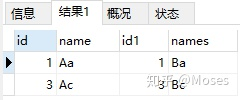

# 数据库

### 数据库左连接，右连接，内连接，全外连接

在对数据库进行查询操作时，可以单表查询，也可以多表连接查询，进行多表连接时，有不同的方式。

1. 自连接：同一张表，自己和自己连接

   ```sql
   SELECT b.lastStation, b.nextStation, a.lastStation, a.nextStation  FROM bus_sche a, bus_sche b WHERE b.nextStation = a.lastStation;
   ```

   只在一张表中查询，表 bus_sche 使用了两个别名 bus_sche a, bus_sche b，因此相当于有两张表，用 WHERE条件连接查询，「 **实际只有一张表在自我连接查询**」。

2. 内连接

   内连接查询操作只列出与连接条件匹配的数据行，使用 **INNER JOIN** 或者直接使用 **JOIN** 进行连接。

   ```sql
   SELECT * from Table_A JOIN Table_B;
   SELECT * from Table_A INNER JOIN Table_B;
   ```

   内连接可以没有连接条件，没有条件之后的查询结果，会保留所有结果（**笛卡尔集**），与后面分享的交叉连接差不多。

   返回的结果中，两张表的列直接拼接在一起，重复的列在后面添加数字序号以做区分。例如下图：

   

3. 左连接（左外连接）：

      ```sql
      select * from a_table a left join b_table b on a.a_id = b.b_id;
      ```

      左表的记录会全部表示出来，而右表只会显示符合搜索条件的记录，右表记录不足的地方均为null。

4. 右连接（右外连接）：

      ```sql
      select * from a_table a  right outer join b_table b  on a.a_id = b.b_id;
      ```

      与左(外)连接相反，右(外)连接，左表(a_table)只会显示符合搜索条件的记录，而右表(b_table)的记录将会全部表示出来。左表记录不足的地方均为null。

5. 全连接：

      ```sql
      SELECT * from Table_A A FULL JOIN Table_B B ON A.id=B.id;
      SELECT * from Table_A A FULL OUTER JOIN Table_B B ON A.id=B.id;
      ```

      根据条件找到表 A 和 表 B 的数据的交集，再加上左右表的数据集。

### 数据库索引，索引是不是越多越好

一个索引是存储的表中一个特定列的值的数据结构（最常见的是平衡树，需要索引列中的数据是有序的）。索引就像数据库的目录，通过使用索引，可以使数据库的查询速度上升，但会导致写入的速度下降。因为目前大部分数据库都是把平衡树作为默认的索引数据结构的，因此增删改数据都会导致平衡树各节点中的索引内容发生变化，就会需要重新调整索引的结构。

如果给表中多个字段加上索引，那么就会出现多个独立的索引结构，每次给某个字段建一个新的索引，字段中的数据就会被复制一份出来，用于生成索引。因此，给表添加索引，会增加表的体积，占用磁盘存储空间。


其他类型的索引：

> 哈希表索引：哈系索引的工作方式是将列的值作为索引的键值（key），和键值相对应实际的值（value）是指向该表中相应行的指针。缺点：哈希表是无序的数据结构，作为索引不够灵活，例如无法查询年龄小于40岁的员工，只能进行相等条件的查询。

主键和索引的区别：

> 1. 主键是为了标识数据库记录唯一性,不允许记录重复,且键值不能为空,主键也是一个特殊索引.
> 2.数据表中只允许有一个主键,但是可以有多个索引.
> 3.使用主键的话，数据库会自动创建主索引,也可以在非主键上创建索引,方便查询效率.
> 4.索引可以提高查询速度,它就相当于字典的目录,可以通过它很快查询到想要的结果,而不需要进行全表扫描.
> 5.其他索引的值可以为空也可以重复. 
> 6. 主键也可以由多个字段组成,组成复合 主键,同时主键肯定也是唯一索引.
> 7.唯一索引则表示该索引值唯一,可以由一个或几个字段组成,一个表可以有多个唯一索引，但只能有一个主键

### mysql怎么实现分页

在对数据库进行查询操作时，如果数据量很大，一次性查询可能会变得很慢，可以使用分页查询方式。MySQL通过limit子句实现分页查询，例如：

```sql
select * from orders_history where type=8 order by id limit 10000,10;
```

> 注意：
>
> 1、第一个参数指定第一个返回记录行的偏移量
>
> 2、第二个参数指定返回记录行的最大数目
>
> 3、如果只给定一个参数：它表示返回最大的记录行数目
>
> 4、第二个参数为 -1 表示检索从某一个偏移量到记录集的结束所有的记录行
>
> 5、初始记录行的偏移量是0(而不是 1)，即上述示例返回第10001行到10011行

缺点：随着查询记录量越来越大，所花费的时间也越来越多；随着查询偏移的增大，查询时间急剧增加

解决方法：

1. 使用子查询优化：

   先定位偏移位置的 id，然后往后查询，这种方式适用于 id 递增的情况，例如：

   ```sql
   select * from orders_history where type=8 limit 100000,1;
   
   select id from orders_history where type=8 limit 100000,1;
   
   select * from orders_history where type=8 and 
   id>=(select id from orders_history where type=8 limit 100000,1) 
   limit 100;
   
   select * from orders_history where type=8 limit 100000,100;
   ```

   4条语句的查询时间如下：

   第1条语句：3674ms

   第2条语句：1315ms

   第3条语句：1327ms

   第4条语句：3710ms

2. 

### 数据库事务

1. 什么是数据库事务

   数据库事务是构成一个单一逻辑工作单元的操作集合。

   > 可以包括一个或多个数据库操作，这些操作要么全部执行成功，要么全部不执行，并且在数据库出现故障以及并发事务存在的情况下依然成立。

2. 事务的ACID特性

   原子性：事务中所有的操作像原子一样不可分割，要么全部成功，要么全部失败。

   一致性：事务的执行结果必须使数据库从一个一致性状态到另一个一致性状态。

   隔离性：并发执行的事务不会相互影响，其对数据库的影响和它们串行执行时一样。比如多个用户同时往一个账户转账,最后账户的结果应该和他们按先后次序转账的结果一样。

   持久性：事务一旦提交，其对数据库的更新就是持久的，任何事务或者系统故障都不会导致数据丢失。

### 常见的并发控制技术

并发控制技术是实现事务隔离性以及不同隔离级别的关键，按照其对冲突的不同策略可以分为乐观并发控制和悲观并发控制两大类。

- 乐观并发控制:对于并发执行可能冲突的操作,假定其不会真的冲突,允许并发执行,直到真正发生冲突时才去解决冲突,比如让事务回滚。
- 悲观并发控制:对于并发执行可能冲突的操作,假定其必定发生冲突,通过让事务等待(锁)或者中止(时间戳排序)的方式使并行的操作串行执行。

**基于封锁的并发控制**

核心思想：对于并发可能冲突的操作，通过锁使它们互斥执行，分为共享锁和排它锁两种类型。

- 1.共享锁(S):事务T对数据A加共享锁,其他事务只能对A加共享锁但不能加排他锁。
- 2.排他锁(X):事务T对数据A加排他锁,其他事务对A既不能加共享锁也不能加排他锁

基于锁的并发控制流程:

1. 事务根据自己对数据项进行的操作类型申请相应的锁(读申请共享锁,写申请排他锁)
2. 申请锁的请求被发送给锁管理器。锁管理器根据当前数据项是否已经有锁以及申请的和持有的锁是否冲突决定是否为该请求授予锁。
3. 若锁被授予,则申请锁的事务可以继续执行;若被拒绝,则申请锁的事务将进行等待,直到锁被其他事务释放。

可能出现的问题:

- 死锁:多个事务持有锁并互相循环等待其他事务的锁导致所有事务都无法继续执行。
- 饥饿:数据项A一直被加共享锁,导致事务一直无法获取A的排他锁。

**基于时间戳的并发控制**：

核心思想：对于并发可能冲突的操作,基于时间戳排序规则选定某事务继续执行,其他事务回滚。

太多了我不想看了，就先这样吧 [数据库事务的概念及其实现原理 - takumiCX - 博客园 (cnblogs.com)](https://www.cnblogs.com/takumicx/p/9998844.html)


### 数据库范式

第一范式：第一范式（1NF）是指数据库表的每一列都是不可分割的基本数据项，同一列中不能有多个值，即实体中的某个属性不能有多个值或者不能有重复的属性。

第二范式：第二范式是在第一范式的基础上建立起来的，**2NF在1NF的基础之上，消除了非主属性对于码的部分函数依赖**，也即一是表必须有一个主键；二是没有包含在主键中的列必须完全依赖于主键，而不能只依赖于主键的一部分。（存疑不想看了）

第三范式：**3NF在2NF的基础之上，消除了非主属性对于码的传递函数依赖**，也就是说， 如果存在非主属性对于码的传递函数依赖，则不符合3NF的要求。

这个问题后面再看看吧[如何理解关系型数据库的常见设计范式？ - 知乎 (zhihu.com)](https://www.zhihu.com/question/24696366)

### 分布式数据库的原理

分布式数据库如何保障数据一致性：


sql in和exist的工作机理是什么

spark和MapReduce的区别是什么

ETL数据仓库技术

SQL语言，一个学生成绩表，选择某科成绩最高学生的语句