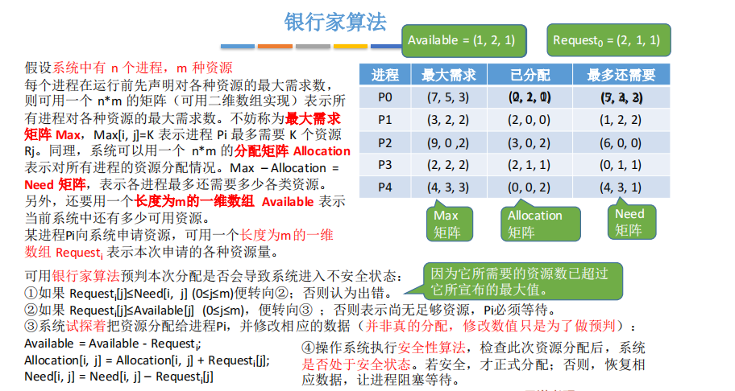

# 航天院所面试问题

## 常规问题：

自我介绍一下吧。

### 有哪些优点和缺点。

我性格开朗随和，为人诚实谦虚，容易相处；在学习和工作上比较踏实和勤奋，自学能力强，善于思考，上进心强；在团队合作中尽职尽责，责任心强。

我的缺点是有些慢热，不擅长过多的交际，和新认识的人交往会熟悉的比较慢。

我喜欢唱歌，喜欢跳拉丁舞，闲暇时间喜欢练习中英文的配音，也曾经为我们实验室的课题项目进行解说配音。

我踏实勤奋，积极上进，希望可以获得这次实习机会。

你都做过什么项目，大概介绍一下。
在这个项目中，你的角色是什么。
遇到的困难有什么？

## 技术问题

### Java和C、Python的区别

java是面向对象的语言，c是面向过程的，python既可以支持面向对象编程，也可以支持面向过程的函数式编程

待补充。。。。。。。

### 说一下排序，时间复杂度，稳定性

### String拼接字符串的缺点

String是java中一个不可变的类，一旦被实例化就无法被修改，所以拼接字符串，就是生成了一个新的字符串，即原变量存储了一个新的String对象的引用。可以使用加号，或者String类中的concat方法。也可以使用StringBuilder或者StringBuffer来实现字符串拼接，这两个类的对象是可以修改的。在多线程操作时使用stringBuffer，单线程操作使用StringBuilder。

使用加号进行字符串拼接，是将 String 转成了 StringBuilder 后，使用其 `append` 方法进行处理的。

使用concat()拼接，会首先创建了一个字符数组，长度是已有字符串和待拼接字符串的长度之和，再把两个字符串的值复制到新的字符数组中，并使用这个字符数组创建一个新的 String 对象并返回。

### String是基本的数据类型吗

String不是基本数据类型，java中的基本数据类型为boolean, byte,short, char, int, long, float, double八种

### StringBuffer是线程安全的吗

是，Stringbuffer大部分方法上都加了synchronize加锁实现的。也因此StringBuffer执行的效率要低于StringBuilder。

### 两个对象equal()之后是不是相等的

equal()默认的行为是比较两个对象的引用，但在大部分java的类库中都重新实现了equals()方法，改成了比较两个对象的实际内容，例如String和Integer等。

### Java锁，synchronized可以修饰静态方法吗

介绍一下wait()

### 进程和线程

一个程序运行后被抽象为一个进程，一个进程又可以被分成多个线程。 进程是操作系统资源分配的基本单位，而线程是cpu调度的最小单位。同一个进程的线程共享本进程的地址空间和资源，而进程之间的地址空间和资源是相互独立的。一个进程崩溃后，对于其他进程没有影响，但一个线程崩溃会导致它所在的进程都崩溃。

### 线程的几种状态

1. **新建(NEW)**：新创建了一个线程对象。

2. **可运行(RUNNABLE)**：线程对象创建后，其他线程(比如main线程）调用了该对象的start()方法。该状态的线程位于可运行线程池中，等待被线程调度选中，获取cpu 的使用权 。

3. **运行(RUNNING)**：可运行状态(runnable)的线程获得了cpu 时间片（timeslice） ，执行程序代码。
4. **阻塞(BLOCKED)**：阻塞状态是指线程因为某种原因放弃了cpu 使用权，也即让出了cpu timeslice，暂时停止运行。直到线程进入可运行(runnable)状态，才有机会再次获得cpu timeslice 转到运行(running)状态。阻塞的情况分三种： 

> (一). 等待阻塞：运行(running)的线程执行o.wait()方法，JVM会把该线程放入等待队列(waitting queue)中。
> (二). 同步阻塞：运行(running)的线程在获取对象的同步锁时，若该同步锁被别的线程占用，则JVM会把该线程放入锁池(lock pool)中。
> (三). 其他阻塞：运行(running)的线程执行Thread.sleep(long ms)或t.join()方法，或者发出了I/O请求时，JVM会把该线程置为阻塞状态。当sleep()状态超时、join()等待线程终止或者超时、或者I/O处理完毕时，线程重新转入可运行(runnable)状态。

5. **死亡(DEAD)**：线程run()、main() 方法执行结束，或者因异常退出了run()方法，则该线程结束生命周期。死亡的线程不可再次复生。

### 死锁 产生条件 怎么解决

死锁是指两个或两个以上的进程在执行过程中，因争夺资源而造成的一种互相等待的现象，若无外力作用，它们都将无法推进下去。称此时系统处于死锁状态或系统产生了死锁。称这些永远在互相等待的进程为死锁进程。

**产生死锁必须同时满足以下四个条件：**

1. 互斥条件：进程要求对所分配的资源进行排它性控制，即在一段时间内某资源仅为一进程所占用。
2. 请求和保持条件：进程已经保持了一个资源，但又提出了新的资源请求，而该资源又被其他进程占有，此时进程因请求资源而阻塞时，但对自己已获得的资源保持不放。
3. 不剥夺条件：进程已获得的资源在未使用完之前，不能剥夺，只能在使用完时由自己释放。
4. 环路等待条件：在发生死锁时，必然存在一个进程--资源的环形链，链中每个进程已获得的资源同时被下一个进程所请求。

**产生死锁的原因：**

1. 对系统资源的竞争，各进程对不可剥夺资源的竞争可能引起死锁，对可剥夺资源的竞争是不会引起死锁的。
2. 进程的推进顺序非法。请求和释放资源的顺序不当，也会导致死锁。
3. 信号量的使用不当也会造成死锁。如生产者-消费者问题中，如果实现互斥的p操作在实现同步的p操作之前，就有可能导致死锁。？？？？？？？？

**死锁的处理策略：**

1. 预防死锁，破坏死锁产生的四个必要条件的一个或几个。

   > 1. 破坏互斥条件：把只能互斥使用的资源改造成允许共享使用。缺点：很多时候无法实施
   > 2. 破坏不可剥夺条件：（1）当某个进程请求新的资源得不到满足时，必须立即释放保持的所有资源，待以后需要时再重新申请；（2）当某个进程需要的资源被其他进程所占有的时候，可以由操作系统协助，将想要的资源强行剥夺。缺点：实现复杂，反复申请释放资源增加系统开销。
   > 3. 破坏请求和保持条件：采用静态分配方法，即进程在运行前一次性申请完它所需要的所有资源，在资源未满足前，不让它投入运行。缺点：造成资源浪费，资源利用率低。
   > 4. 破坏循环等待条件：采用顺序资源分配法，给系统中的资源编号，规定每个进程必须按照编号递增的顺序请求资源。这样一来，已持有大编号资源的进程不可能逆向的回来申请小编号资源，从而避免产生循环等待的现象。缺点：进程实际使用资源的顺序可能和编号递增顺序不一致，导致资源浪费。

2. 避免死锁，用某种方法防治系统进入不安全状态，从而避免死锁（银行家算法）

   > 银行家算法核心思想：在资源分配之前预先判断这次分配是否会导致系统进入不安全状态，以此决定是否答应资源分配请求。
   >
   > 
   >
   > 安全性算法步骤：检查当前剩余的可用资源是否可以满足某个进程的最大需要，如果可以，就把该进程加入安全序列并回收该进程持有的全部资源，不断重复上述过程，看最终是否能让所有的进程都加入安全序列。

3. 死锁的检测和解除。允许死锁发生，不过操作系统会负责检测出死锁的发生，然后采取某种措施解除死锁。

   > 死锁的解除：
   >
   > 1. **撤消进程法**
   >     撤消全部死锁进程：代价太大，该做法很少用。
   >     最小代价撤消法：首先计算死锁进程的撤消代价，然后依次选择撤消代价最小的进程，逐个地撤消死锁进程，回收资源给其他进程，直至死锁不复存在。进程的撤消代价往往与进程的优先级、占用处理机的时间等成正比。
   > 2. **挂起进程法 （剥夺资源）**
   >      使用挂起/激活机构挂起一些进程，剥夺它们的资源以解除死锁，待条件满足时，再激活进程。目前挂起法比较受到重视。 

哲学家进餐问题，什么时候都吃不上饭

### 使用哪个版本的jdk，有哪些特性

平时主要用java 8。java 8首要的一个新特性是支持lamda表达式和函数接口，用lambda表达式来替换单方法接口，可以把函数当成参数传递给某个方法，简化了一部分需要使用匿名类的场景（这里再去复习一下匿名类的使用场景）最简单的Lambda表达式可由逗号分隔的参数列表、**->**符号和语句块组成。函数接口是为了兼容lambda表达式产生的概念，指的是只有一个函数的接口，这样的接口可以隐式的转化成lambda表达式。Java 8 提供了一个注解**@FunctionalInterface**，来显示的说明函数式接口。

java8的另一个特性是接口中可以定义默认方法和静态方法。接口提供的默认方法会被接口的实现类继承或者重写。这样的目的是可以在不破坏现有兼容性的前提下，往接口中添加新的方法。

java8也引进了新的Date-Time Api 来改进时间，日期的处理。

java8支持重复注解

支持方法引用，通常和lambda表达式结合着使用，没用过不了解

### Java list和set的区别，是否继承自Collection接口

list和set继承自Collection接口，map不是。

list和set分别是collection的两个子接口，区别为：

1. list及其实现类是可变大小的列表，适用于按照数值索引访问元素
2. Set集合无需存储，并且不可以保存重复的元素

数据库内连接

数据库索引，索引是不是越多越好

mysql怎么实现分页

分布式数据库的原理

SQL语言，一个学生成绩表，选择某科成绩最高学生的语句

前端学过吗

用过什么语言做过开发（java，go，php），数据库有没有优化的，抗量怎么做的，重载和重写的区别