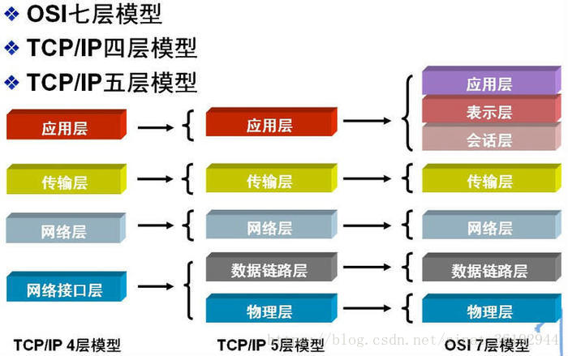
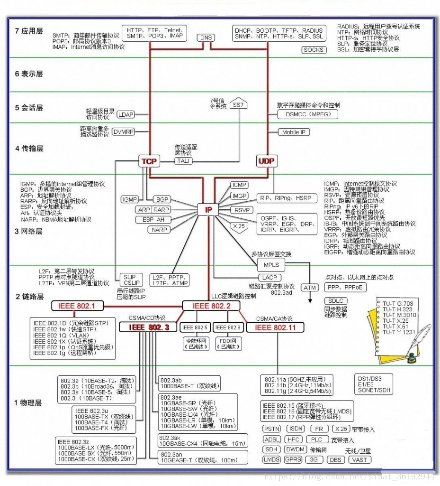
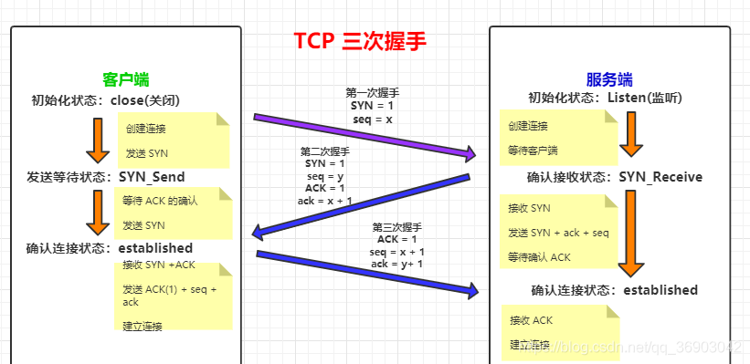
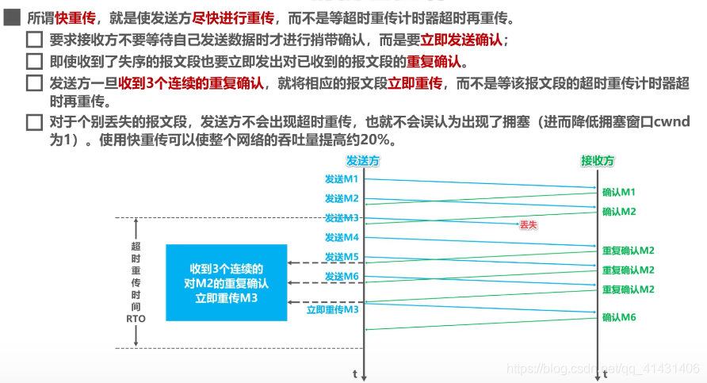
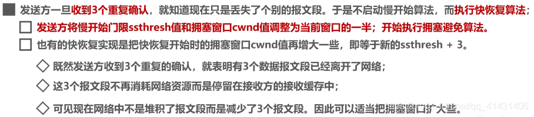
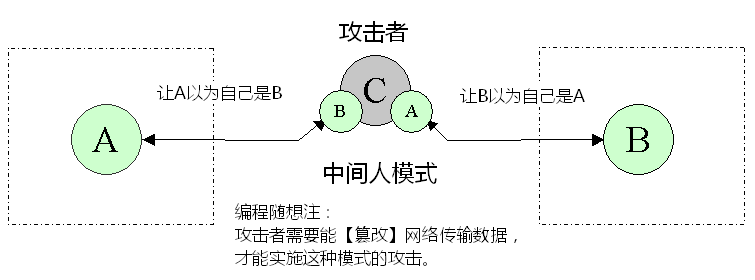
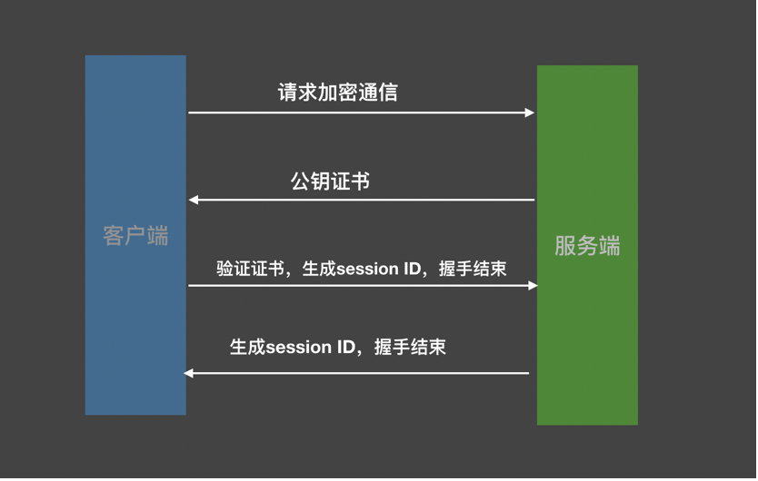

## 计算机网络的协议分层





### 一、物理层（Physical Layer）

OSI模型的最低层或第一层，规定了激活、维持、关闭通信端点之间的机械特性、电气特性、功能特性以及过程特性，为上层协议提供了一个传输数据的物理媒体。 
 在这一层，协议数据单元为比特（bit）。 
 在物理层的互联设备包括：集线器（Hub）、中继器（Repeater）等。

### 二、数据链路层（Datalink Layer）

OSI模型的第二层，它控制网络层与物理层之间的通信，其主要功能是**在不可靠的物理介质上提供可靠的传输**。该层的作用包括：物理地址寻址、数据的成帧、流量控制、数据的检错、重发等。 
在这一层，协议数据单元为帧（frame）。 
在数据链路层的互联设备包括：网桥（Bridge）、交换机（Switch）等。

身份标识：MAC地址

### 三、网络层（Network Layer）

OSI模型的第三层，其主要功能是将网络地址翻译成对应的物理地 ，并决定如何将数据从发送方路由到接收方。该层的作用包括：**对子网间的数据包进行路由选择，实现拥塞控制、网际互连等功能**。 
在这一层，协议数据单元为数据包（packet）。 
在网络层的互联设备包括：路由器（Router）等。

身份标识：IP地址

网络层协议：IP、OSPF、RIP、ARP、ICMP

#### ARP协议

地址解析协议，即ARP（Address Resolution Protocol），是根据IP地址获取物理地址的一个TCP/IP协议。主机发送信息时将包含目标IP地址的ARP请求广播到局域网络上的所有主机，并接收返回消息，以此确定目标的物理地址；收到返回消息后将该IP地址和物理地址存入本机ARP缓存中并保留一定时间，下次请求时直接查询ARP缓存以节约资源。

#### ICMP协议

ICMP（Internet Control Message Protocol）Internet控制报文协议。它是TCP/IP协议簇的一个子协议，用于在IP主机、路由器之间传递控制消息。控制消息是指网络通不通、主机是否可达、路由是否可用等网络本身的消息。这些控制消息虽然并不传输用户数据，但是对于用户数据的传递起着重要的作用。

#### IP协议不提供可靠传输

注意，在网络层没有提到可靠传输，网络层的IP协议不提供可靠传输。

计算机网络的设计者采用了一种策略，这就是“端到端的可靠传输”。更具体些，就是在运输层使用面向连接的 TCP 协议，它可保证端到端的可靠传输。只要主机 B 的 TCP 发现了数据的传输有差错，就告诉主机 A  将出现差错的那部分数据重传，直到这部分数据正确传送到主机 B 为止。而 TCP  发现不了数据有差错的概率是很小的。采用这样的建网策略，既可以使网络部分价格便宜和灵活可靠，又能够保证端到端的可靠传输。

#### IP协议与UDP的协议重复吗？

那么问题来了，既然IP是不可靠的数据传输，为啥还在网络层增加一个UDP协议？

1. UDP通过16位源端口号和16位目的端口号来实现应用程序间的区分。

2. 16位UDP校验和可以实现传输层的校验，虽然UDP协议不具备纠错能力，但是可以对出错的数据包进行丢弃。那么大家要问了，IP协议不是也有校验吗？问题是IP协议只校验IP报头而不是整个数据包，整个数据包的校验是在传输层完成的。

3. 传输层和网络层在操作系统内的实现层次不同，给用户开放的权限也不同，并非所有用户都可以直接操作IP协议，出于安全和易操作性的考虑，现代操作系统往往不允许/不建议普通用户直接操作IP协议，一般是用户完成传输层协议封装，然后由操作系统进行网络层封装和校验和计算。

综上，IP协议无法代替UDP协议。

#### 当前所用的路由协议直接的区别

目前流行的还是AS间用BGP，AS内用OSPF构建网络。

|              | RIP                                        | OSPF                       | BGP                        |
| ------------ | ------------------------------------------ | -------------------------- | -------------------------- |
| 网关协议     | 内部                                       | 内部                       | 外部                       |
| 路由算法     | 距离矢量                                   | 链路状态                   | 距离矢量                   |
| 传送方式     | UDP                                        | IP                         | TCP                        |
| 最优通路依据 | 跳数                                       | 费用（可自行设定）         | 网管定义的多种策略         |
| 特点         | 最大跳数为16；坏消息传的慢；交换路由信息慢 | 路由器频繁交换信息，效率高 | 利于人为指定AS间的路由策略 |

#### ping的过程，用到了哪些协议

假设现在要ping www.baidu.com，首先通过DNS获取到目标IP地址，然后构造一个固定格式的ICMP回显请求报文放入IP数据报中，接着通过ARP获取目标MAC地址，将数据发送出去，而在接收方收到数据帧之后，解封、检查、提取有用信息，构造相应的ICMP回显应答报文，发送给主机A。

重点：ping 域名、DNS、ping ip、ARP、ICMP回显、ICMP回显应答

#### traceroute实现原理

利用路由器每次转发ICMP回送请求报文之前都要将其TTL值-1这个特性，通过向目的地发送具有TTL为1的第一个回送请求报文并在随后的发送中每次将TTL值+1，直到目标发送回送应答报文，由此可得从本地计算机到目的主机的完整路径。

traceroute第一个作用是追踪去往目的地址时途径的各个节点，第二个作用是故意在IP包的首部设置不分片，从而确定路径的MTU，`traceroute baidu.con --mtu`

### 四、传输层（Transport Layer）

OSI模型中最重要的一层，是第一个端到端，即主机到主机的层次。其主要功能是**负责将上层数据分段并提供端到端的、可靠的或不可靠的传输。**此外，传输层还要处理端到端的**差错控制**和**流量控制**问题。 
在这一层，协议数据单元为数据段（segment）。 
传输层协议的代表包括：TCP、UDP、SPX等。

#### 无连接运输：UDP

UDP的几个特点或者说优点：

- 关于发送什么数据以及何时发送的应用层控制更为精细
- 无需建立连接。DNS建立在UDP上，因为UDP的速度更快
- 无连接状态
- 分组头部开销小

#### 面向连接的运输：TCP

TCP在IP不可靠的尽力而为服务之上，创建了一种**可靠数据传输服务**。

##### 三次握手的报文段

```
客户端想要与服务器建立连接，需要三次握手
client -> server  (SYN=1, seq=x)
server -> client  (SYN=1, ACK=1, seq=y, ack=x+1)
client -> server  (SYN=0, ACK=1, seq=x+1, ack=y+1)
```



##### 为什么是三次握手不是两次？

如果只是两次握手，会出现这样的情况，客户端发出了第一个请求建立连接的报文段在一定时间内没有得到回复，客户端又发出了第二条报文段，该报文段被服务器端接收到，然后服务器端对其进行了确认回复，二者建立连接。当通信结束后，因为一些网络延迟的原因，第一个报文段才到达服务器端，服务器以为客户端又要申请建立连接，也做了确认的回复，但是此时客户端并没有想要建立连接。

总结：即两次握手会造成消息滞留情况下，服务器重复接受无用的连接请求 `SYN` 报文，而造成重复分配资源。

##### 为什么是三次握手而不是更多次？

三次是保证双方互相明确对方能收能发的最低值（来自谢希仁《计算机网络》）。

理论上讲不论握手多少次都不能确认一条信道是“可靠”的，但通过3次握手可以至少确认它是“可用”的，再往上加握手次数不过是提高“它是可用的”这个结论的可信程度。

总结：这是工科的一种实用性的选择。

##### 四次挥手的报文段

```
客户端发完了报文段准备结束连接
client -> server  (FIN=1, seq=x)			客户端将最后一个报文发给服务器，并将FIN置为1
server -> client  (ack=x+1, seq=y)			服务器收到该报文并确认
...											此时客户端已经停止给服务器发送新的报文，而服务器可能还有数据要传输，等服务器传输结束时
server -> client  (FIN=1, seq=y+n)			服务器将最后一个报文段发给客户端，并将FIN置为1		
client -> server  (ack=y+n+1, seq=x+n+1)	客户端收到该报文并确认
```

##### TCP如何保证可靠性

- 数据分块：应用数据被分割成 TCP 认为最适合发送的数据块。
- 序列号和确认应答：TCP 给发送的每一个包进行编号，在传输的过程中，每次接收方收到数据后，都会对传输方进行确认应答，即发送 ACK 报文，这个 ACK 报文当中带有对应的确认序列号，告诉发送方成功接收了哪些数据以及下一次的数据从哪里开始发。除此之外，接收方可以根据序列号对数据包进行排序，把有序数据传送给应用层，并丢弃重复的数据。
- 校验和： TCP 将保持它首部和数据部分的检验和。这是一个端到端的检验和，目的是检测数据在传输过程中的任何变化。如果收到报文段的检验和有差错，TCP 将丢弃这个报文段并且不确认收到此报文段。
- 流量控制：TCP 连接的双方都有一个固定大小的缓冲空间，发送方发送的数据量不能超过接收端缓冲区的大小。当接收方来不及处理发送方的数据，会提示发送方降低发送的速率，防止产生丢包。TCP 通过**滑动窗口协议**来支持流量控制机制。
- 拥塞控制
- ARQ（自动重传请求）协议：基本原理就是每发完一个分组就停止发送，等待对方确认。在收到确认后再发下一个分组。
- 超时重传：发送方在发送一次数据后就开启一个定时器，在一定时间内如果没有得到发送数据包的 ACK 报文，那么就重新发送数据，在达到一定次数还没有成功的话就放弃重传并发送一个复位信号。

##### 为什么UDP是不可靠的

UDP 只有一个 socket 接收缓冲区，没有 socket 发送缓冲区，即只要有数据就发，不管对方是否可以正确接收。对方的 socket 接收缓冲区满了之后，新来的数据报无法进入到 socket 接受缓冲区，此数据报就会被丢弃。

此外，UDP 也没有流量控制和重传机制。

和 TCP 建立连接时采用三次握手不同，UDP 中调用 connect 只是把对端的 IP 和 端口号记录下来。

##### TCP的ARQ协议

传统自动重传请求分成为三种，即停等式(stop-and-wait）ARQ，回退n帧（go-back-n）ARQ，以及选择性重传（selective repeat）ARQ。后两种协议是滑动窗口技术与请求重发技术的结合，由于窗口尺寸开到足够大时，帧在线路上可以连续地流动，因此又称其为连续ARQ协议。三者的区别在于对于出错的数据报文的处理机制不同。除了传统的ARQ，还有混合ARQ（Hybrid-ARQ）。

- 停等式ARQ：在停等式ARQ中，数据报文发送完成之后，发送方等待接收方的状态报告，如果状态报告报文发送成功，发送后续的数据报文，否则重传该报文。也就说，**停等式ARQ的发送窗口和接收窗口大小都为1**。所需的缓冲空间小，但是信道利用率低。
- 回退N帧ARQ：发信侧不用等待收信侧的应答，持续的发送多个帧，假如发现已发送的帧中有错误发生，那么从那个发生错误的帧开始及其之后所有的帧全部再重新发送。
- 选择性重传ARQ：发信侧不用等待收信侧的应答，持续的发送多个帧，假如发现已发送的帧中有错误发生，那么发信侧将只重新发送那个发生错误的帧。

##### TCP的最大连接数限制

因为客户端的端口在TCP连接中是独占的，所以客户端的最大TCP连接等于本地的最大的端口数65536个，但是0号不能用，只剩下65535个。

服务器端的一个端口号可以连接多个TCP，例如https对应的443端口。所以理论上来说，最大 TCP 连接为客户端 IP 数 × 客户端 port 数，是非常巨大的。实际还要考虑并发的性能。

##### TCP流量控制

- 所谓流量控制就是让发送发送速率不要过快，让接收方来得及接收。TCP利用滑动窗口机制实现流量控制

- TCP以字节（而非包）为单位来维护其窗口结构，每个TCP活动连接的两端维护一个发送窗口和接收窗口结构。

- TCP的滑动窗口主要有两个作用：① 提供TCP的可靠性 ② 提供TCP的流控特性。

- 发送窗口：有三个术语用于描述窗口左右边界运动
  ①关闭：窗口左边界右移。当已发送的数据收到ACK时发生，窗口减小。
  ②打开：窗口右边界右移，可发送数据量增大。当ACK时，确认数据得到处理，接收端可用缓存变大时发生，窗口也变大。
  ③收缩：窗口右边界左移。

  

- 接收窗口：比发送窗口简单。用于记录已接收并确认过的数据、能够接收的最大序列号。

  

##### 如果接收窗口满了，发送方会怎么做？

基于 TCP 流量控制中的滑动窗口协议，我们知道接收方返回给发送方的 ACK 包中会包含自己的接收窗口大小，若接收窗口已满，此时接收方返回给发送方的接收窗口大小为 0，此时发送方会等待接收方发送的窗口大小直到变为非 0 为止，然而，接收方回应的 ACK 包是存在丢失的可能的，为了防止双方一直等待而出现死锁情况，此时就需要坚持计时器来辅助发送方周期性地向接收方查询，以便发现窗口是否变大，当发现窗口大小变为非零时，发送方便继续发送数据。

##### 糊涂窗口综合征

- 什么是糊涂窗口综合征

  当发送端应用进程产生数据很慢、或接收端应用进程处理接收缓冲区数据很慢，或二者兼而有之；就会使应用进程间传送的报文段很小，特别是有效载荷很小。极端情况下，有效载荷可能只有1个字节；而传输开销有40字节(20字节的IP头+20字节的TCP头) 这种现象就叫糊涂窗口综合症。

- 发送端引起的SWS

  如果发送端为产生数据很慢的应用程序服务(典型的有telnet应用)，例如，一次产生一个字节。这个应用程序一次将一个字节的数据写入发送端的TCP的缓存。如果发送端的TCP没有特定的指令，它就产生只包括一个字节数据的报文段。结果有很多41字节的IP数据报就在互连网中传来传去。**解决方法：Nagle算法。**

- 接收端引起的SWS

  接收端的应用程序消耗数据比较慢，例如每次只消耗一个字节，这样发送端就会每次发送只包含一个字节数据的报文段。**解决方法：只要有数据到达就发送确认，但宣布窗口大小为零；或延迟一段时间再发送确认报文**

- Nagle算法

  目的：为了尽可能的利用网络带宽，要尽可能发送大块数据，避免网络中充斥着许多小数据块。

  方法：Nagle算法要求**TCP连接上最多只能有一个未被确认的小分组，在该分组的确认到达之前不能发送其他的小分组**。相反，TCP收集这些少量的小分组，并在确认到来时以一个分组的方式发出去。

  Nagle 算法的规则：

  1. 如果包长度达到 MSS ，则允许发送；
  2. 如果该包含有 FIN ，则允许发送；
  3. 设置了 *TCP_NODELAY* 选项，则允许发送；
  4. 未设置 *TCP_CORK* 选项时，若所有发出去的小数据包（包长度小于 MSS ）均被确认，则允许发送；
  5. 上述条件都未满足，但发生了超时（一般为 200ms ），则立即发送。

  > 1. 长度达到MSS，说明不是小块数据
  >
  > 2. 包含FIN，说明要关闭连接
  >
  > 3. TCP_NODELAY 选项 
  >
  >    默认情况下，发送数据采用 Negale 算法。这样虽然提高了网络吞吐量，但是实时性却降低了，在一些交互性很强的应用程序来说是不允许的，使用 TCP_NODELAY 选项可以禁止 Negale 算法。
  >
  >    此时，应用程序向内核递交的每个数据包都会立即发送出去。需要注意的是，虽然禁止了 Negale 算法，但网络的传输仍然受到 TCP 确认延迟机制的影响。
  >
  > 4. TCP_CORK 选项
  >
  >    所谓的 CORK 就是塞子的意思，形象地理解就是用 CORK 将连接塞住，使得数据先不发出去，等到拔去塞子后再发出去。设置该选项后，内核会尽力把小数据包拼接成一个大的数据包（一个 MTU）再发送出去，当然若一定时间后（一般为 200ms ，该值尚待确认），内核仍然没有组合成一个 MTU 时也必须发送现有的数据（不可能让数据一直等待吧）。
  >
  >    然而，TCP_CORK 的实现可能并不像你想象的那么完美，CORK 并不会将连接完全塞住。内核其实并不知道应用层到底什么时候会发送第二批数据用于和第一批数据拼接以达到 MTU 的大小，因此内核会给出一个时间限制，在该时间内没有拼接成一个大包（努力接近 MTU ）的话，内核就会无条件发送。也就是说若应用层程序发送小包数据的间隔不够短时，TCP_CORK 就没有一点作用，反而失去了数据的实时性（每个小包数据都会延时一定时间再发送）。

##### TCP延迟确认机制

##### TCP流量控制与拥塞控制

- 流量控制：目的是让发送方的发送速率不要太快，让接收方来得及接收。在 TCP 中利用可变长的滑动窗口机制可以很方便的在 TCP 连接上实现对发送方的流量控制。主要的方式是接收方返回的 ACK 中会包含自己的接收窗口大小，以控制发送方此次发送的数据量大小（发送窗口大小）。

- 拥塞控制：慢开始，拥塞避免，快重传，快恢复

  慢开始和拥塞避免通过下图比较容易理解。下面主要介绍一下快重传和快恢复。

  

  

  

- 拥塞控制和流量控制的区别：拥塞控制往往是一种全局的，防止过多的数据注入到网络之中，而TCP连接的端点只要不能收到对方的确认信息，猜想在网络中发生了拥塞，但并不知道发生在何处。而流量控制往往指点对点通信量的控制，是端到端的问题。


##### TCP粘包拆包

发送方写入的数据大于套接字缓冲区的大小，此时将发生拆包。

发送方写入的数据小于套接字缓冲区大小，由于 TCP 默认使用 Nagle 算法，只有当收到一个确认后，才将分组发送给对端，当发送方收集了多个较小的分组，就会一起发送给对端，这将会发生粘包。

进行 MSS （最大报文长度）大小的 TCP 分段，当 TCP 报文的数据部分大于 MSS 的时候将发生拆包。

发送方发送的数据太快，接收方处理数据的速度赶不上发送端的速度，将发生粘包。

- 常见解决方法

在消息的头部添加消息长度字段，服务端获取消息头的时候解析消息长度，然后向后读取相应长度的内容。

固定消息数据的长度，服务端每次读取既定长度的内容作为一条完整消息，当消息不够长时，空位补上固定字符。但是该方法会浪费网络资源。

设置消息边界，也可以理解为分隔符，服务端从数据流中按消息边界分离出消息内容，一般使用换行符。

##### SNY FLOOD 是什么

SYN Flood 是种典型的 DoS（拒绝服务）攻击，其目的是通过消耗服务器所有可用资源使服务器无法用于处理合法请求。通过重复发送初始连接请求（SYN）数据包，攻击者能够压倒目标服务器上的所有可用端口，导致目标设备根本不响应合法请求。

##### 为什么服务端容易受到SYN攻击

在 TCP 建立连接的过程中，因为服务端不确定自己发给客户端的 SYN-ACK 消息或客户端反馈的 ACK 消息是否会丢在半路，所以会给每个待完成的半开连接状态设一个定时器，如果超过时间还没有收到客户端的 ACK 消息，则重新发送一次 SYN-ACK 消息给客户端，直到重试超过一定次数时才会放弃。

服务端为了维持半开连接状态，需要分配内核资源维护半开连接。当攻击者伪造海量的虚假 IP 向服务端发送 SYN 包时，就形成了 SYN FLOOD 攻击。攻击者故意不响应 ACK 消息，导致服务端被大量注定不能完成的半开连接占据，直到资源耗尽，停止响应正常的连接请求。


##### 端口号最多有多少个

端口号的长度为16位，所以理论上有 $2^{16}=65536$ 个，取值范围是$[0, 65535]$。因为端口0一般是用来表示所有端口，即1–65535，所以最大可用的端口号有$2^{16}-1=65536$ 个

端口有三个类型：

- 公认端口（Well Known Ports）是众所周知的端度口号，范围从0到1023。
- 动态端口（Dynamic Ports）范围是从49152到65535。之所以称为动态端口，是因为它 一般不固定分配某种知服务，而是动态分道配。
- 注册端口（RegisteredPorts）范围是从1024到49151，分配给用户进程或应用程序。这些进程主要是用户选择安装的一些回应用程序，而不是已经分配好了公认端口的常用程序。这些端口在没有被服务器资源占用的时候，可以用用户端动态选用为源答端口。


### 五、应用层

应用层的协议：DNS（使用UDP）、FTP（使用TCP）、SMTP（简单邮件传输协议，使用TCP）、HTTP（使用TCP）、Telnet（远程登录协议）

#### HTTP与HTTPS协议

HTTP默认端口80，HTTPS默认端口443


##### HTTP协议

HTTP协议（Hypertext Transfer Protocol）也就是超文本传输协议，是一种使用明文数据传输的网络协议。导致了传输内容会被嗅探和篡改。

被广泛使用过的HTTP协议主要有1.0版本和1.1版本。在 HTTP 1.0 版本，【默认】使用的是“短连接”（那时候是 Web 诞生初期，网页相对简单，“短连接”的问题不大）；到了1995年底开始制定 HTTP 1.1  草案的时候，网页已经开始变得复杂（网页内的图片、脚本越来越多了）。这时候再用短连接的方式，效率太低下了（因为建立 TCP  连接是有“时间成本”和“CPU 成本”滴）。所以，在 HTTP 1.1 中，【默认】采用的是“Keep-Alive”的方式。

**短连接连接一次，只拿一个，需要啥东西，再回去建立连接。长链接是一直保持连接，但不是一直传输，边分析边回去拿。**

> HTTP 对 TCP 连接的使用，分为两种方式：俗称“短连接”和“长连接”（“长连接”又称“持久连接”，洋文叫做“Keep-Alive”或“Persistent Connection”）
>
> 假设有一个网页，里面包含好多图片，还包含好多【外部的】CSS 文件和 JS 文件。在“短连接”的模式下，浏览器会先发起一个 TCP  连接，拿到该网页的 HTML 源代码（拿到 HTML 之后，这个 TCP  连接就关闭了）。然后，浏览器开始分析这个网页的源码，知道这个页面包含很多外部资源（图片、CSS、JS）。然后针对【每一个】外部资源，再分别发起一个个 TCP 连接，把这些文件获取到本地（同样的，每抓取一个外部资源后，相应的 TCP 就断开）
>
> 相反，如果是“长连接”的方式，浏览器也会先发起一个 TCP 连接去抓取页面。但是抓取页面之后，该 TCP  连接并不会立即关闭，而是暂时先保持着（所谓的“Keep-Alive”）。然后浏览器分析 HTML 源码之后，发现有很多外部资源，就用刚才那个  TCP 连接去抓取此页面的外部资源。


##### HTTPS协议

HTTPS协议（Hyper Text Transfer Protocol over SecureSocket Layer）即安全套接字层超文本传输协议，为了解决HTTP存在的安全性缺陷，HTTPS在HTTP的基础上加入了SSL/TLS协议，SSL/TLS依靠证书来验证服务器的身份，并为浏览器和服务器之间的通信加密。

> TLS（Transport Layer Security，传输层安全协议），前身为 SSL （Secure Socket Layer，安全套接层）

具体来说：

对称加密：加密和解密使用相同的密钥。即一个密钥既可以用来加密也可以用来解密。

非对称加密：非对称加密加密和解密使用不同的密钥，加密的密钥只能用来加密，解密的密钥只能用来解密。但是性能比对称加密要差。

HTTPS实际上是在HTTP协议数据的基础上，增加了一层SSL的封装。是HTTP over SSL。难点在于，密钥交换，在还没有完成密钥交换的时候，双方协商加密解密算法和交换密钥的时候，用到的都是明文传输，这就自然可能会被第三方嗅探到。

那么如何实现密钥交换？

- 单纯使用对称加密算法：密钥在网络上明文传输，如果被第三者嗅探到，就会导致泄密。

- 单纯使用非对称加密算法

  - 步骤如下：

    > 第1步 
    >  网站服务器先基于“非对称加密算法”，随机生成一个“密钥对”（为叙述方便，称之为“k1 和 k2”）。因为是随机生成的，目前为止，只有网站服务器才知道 k1 和 k2。
    >
    > 第2步 
    >  网站把 k1 保留在自己手中，把 k2 用【明文】的方式发送给访问者的浏览器。 
    >  因为 k2 是明文发送的，自然有可能被偷窥。不过不要紧。即使偷窥者拿到 k2，也【很难】根据 k2 推算出 k1 
    >  （这一点是由“非对称加密算法”从数学上保证的）。
    >
    > 第3步 
    >  浏览器拿到 k2 之后，先【随机生成】第三个对称加密的密钥（简称 k）。 
    >  然后用 k2 加密 k，得到 k’（k’ 是 k 的加密结果） 
    >  浏览器把 k’ 发送给网站服务器。
    >
    > 由于 k1 和 k2 是成对的，所以只有 k1 才能解密 k2 的加密结果。 
    >  因此这个过程中，即使被第三方偷窥，第三方也【无法】从 k’ 解密得到 k
    >
    > 第4步 
    >  网站服务器拿到 k’ 之后，用 k1 进行解密，得到 k 
    >  至此，浏览器和网站服务器就完成了密钥交换，双方都知道 k，而且【貌似】第三方无法拿到 k 
    >  然后，双方就可以用 k 来进行数据双向传输的加密。

  - 存在问题：

    无法防范攻击者篡改。如下图所示：

    

- 基于CA数字证书的密钥交换

  通过引入CA数字证书，来给服务器端背书，客户端可以通过验证CA数字证书的正确性，来验证服务器端的真实性。防止B将攻击者认成是A。

  握手阶段的四次通信过程如下图所示：

  

  具体地：

  1. 客户端向服务器发起加密通信的请求，这次请求称为ClientHello。发送的内容包括一个随机数X，用来后续产生会话密钥的客户端支持的加密算法和客户端支持的SSL协议版本支持的压缩方式。
  2. 服务端收到请求后，响应客户端请求，这次请求称为ServerHello。返回数据为确认支持的SSL协议版本 确认加密算法 服务端公钥，为了数据安全，会放到证书中 一个随机数Y，用来后续生产会话密钥。
  3. 客户端收到服务器的响应后，首先验证证书的有效性（是否是认证机构颁发，是否在有效期内），验证通过后，会从证书中取出公钥，并向服务器端发送如下数据：一个随机数Z，用来后续生产会话密钥，注意这个随机数会用公钥加密 一个通知，告诉服务端，后续通信都用商定的加密方式和会话密钥进行 一个通知，告诉服务端，客户端握手结束。
  4. 服务端收到最后一个随机数以后，用私钥解密后就有了跟客户端一样的三个随机数，然后生成与客户端相同的会话密钥，并做出最后的回应。

#### HTTP中的GET和POST

##### 基本概念

GET用来获取资源，它只是获取、查询数据，不会修改服务器上上数据。由于它是读取的，因此可以对GET所请求的数据进行缓存，这个缓存可以在浏览器上，也可以在代理上，或者在Server端。

POST可以想服务器发送修改请求，进行数据修改。举个例子：比如说我们要在知乎、或者论坛下面评论，这个时候就需要用到`POST`请求。但是它不能缓存，为什么呢？设想如果我们将“评论成功”的页面缓存在本地，那么当我发送一个请求的时候，直接返回本地的“评论成功”页面，而服务器端则什么也没有做，根本没有进行评论的更新，岂不是难以想象。

##### 区别

一些表面上的区别：

- `GET`没有`POST`安全。这里是相对的，凡是HTTP就不安全。
- `GET`请求时`URL`的长度是有限制的。这里因为要对URL进行解析，如果URL的长度无限长，则会耗费很大的资源来解析，所以URL的长度是特定的浏览器和服务器设置的。
- `GET`没有`body`而`POST`有`body`。这也是一个通俗的规定，理论上来说，在自己使用的时候，GET也可以有body。


#### OSI模型的分层 

##### 1.OSI模型的会话层（Session Layer）

OSI模型的第五层，管理主机之间的会话进程，即负责建立、管理、终止进程之间的会话。其主要功能是建立通信链接，保持会话过程通信链接的畅通，利用在数据中插入校验点来同步两个结点之间的对话，决定通信是否被中断以及通信中断时决定从何处重新发送。

##### 2. OSI模型的表示层（Presentation Layer）

OSI模型的第六层，应用程序和网络之间的翻译官，负责对上层数据或信息进行变换以保证一个主机应用层信息可以被另一个主机的应用程序理解。表示层的数据转换包括数据的解密和加密、压缩、格式转换等。

##### 3. OSI模型的应用层（Application Layer）

OSI模型的第七层，负责为操作系统或网络应用程序提供访问网络服务的接口。术语“应用层”并不是指运行在网络上的某个特别应用程序，应用层提供的服务包括文件传输、文件管理以及电子邮件的信息处理。


## 访问一个网址的全过程

本题也可以叫做，浏览器上输入URL会发生什么？

#### 1.DNS解析

- 浏览器首先搜索自身缓存的DNS记录

- 若没找到，则搜索host文件

  > 其作用就是将一些常用的网址域名与其对应的IP地址建立一个关联“数据库”，当用户在浏览器中输入一个需要登录的网址时，系统会首先自动从Hosts文件中寻找对应的IP地址，一旦找到，系统会立即打开对应网页，如果没有找到，则系统会再将网址提交DNS域名解析服务器进行IP地址的解析。
  >
  > 类似于主机自己的一个域名解析缓存。

- 如果在host文件中没找到或者记录已经过期了，则向域名解析服务器方解析请求。系统会向DNS服务器发出正式解析请求。

- 如果域名解析服务器也没有该域名的记录，则开始**递归+迭代解析**。

  > 什么是递归：问题由一开始的本机要解析mail.google.com变成域名解析服务器要解析mail.google.com，这是递归。即，client 解析 mail.google.com 的结果 = dns_server 解析 mail.google.com 的结果。就像是函数递归。
  >
  > 什么是迭代：问题由向根域服务器发出请求变成向com域服务器发出请求再变成向google.com域发出请求，这是迭代。即，域名解析服务器依次向A，B，C，...，请求结果。就像是在一个列表中循环迭代，循环遍历。

- 获取域名对应的IP后，将结果一步步返回，直到返回给浏览器

#### 2.发起TCP请求

浏览器会选择一个大于1024的本机端口向目标IP地址的80/443端口发起TCP连接请求。经过 标准的TCP握手流程，建立TCP连接。

#### 3.发起HTTP请求

其本质是在建立起的TCP连接中，按照HTTP协议标准，发送一个索要网页的请求。

####  4.浏览器渲染、网页静态资源加载
